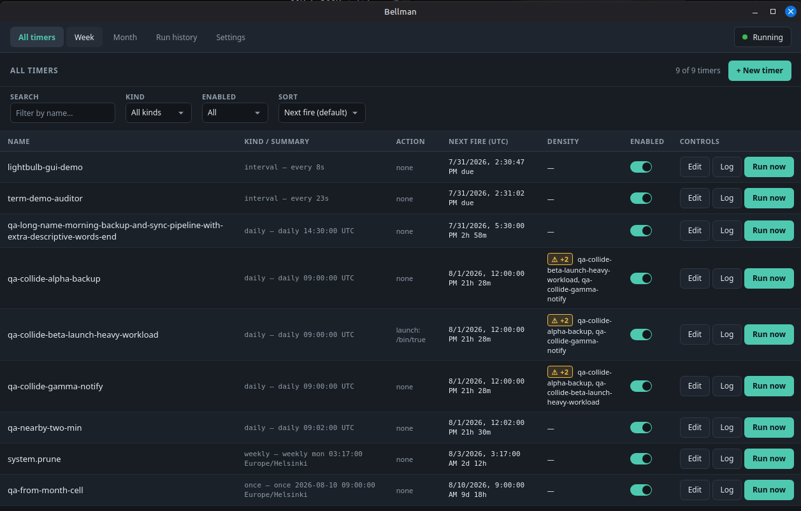
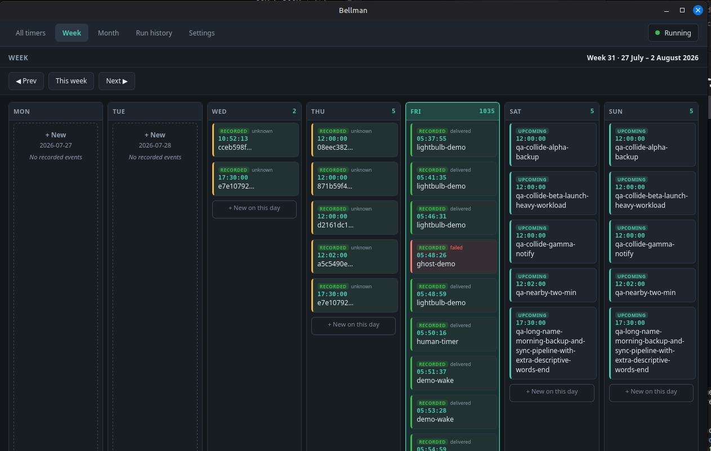
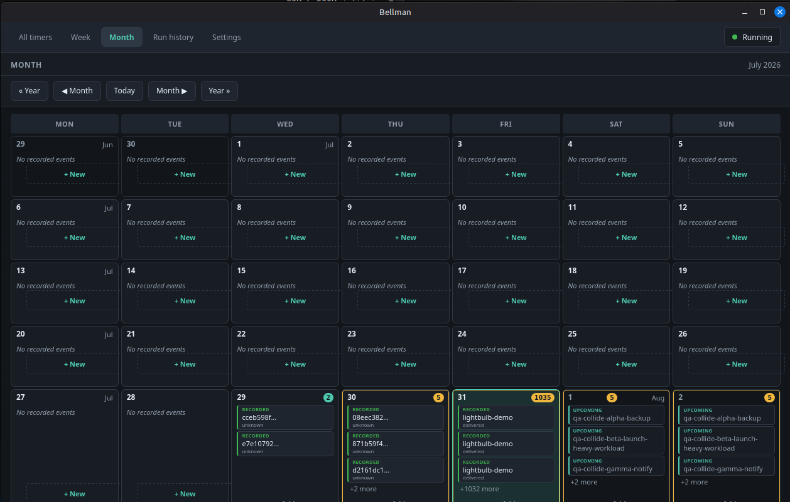
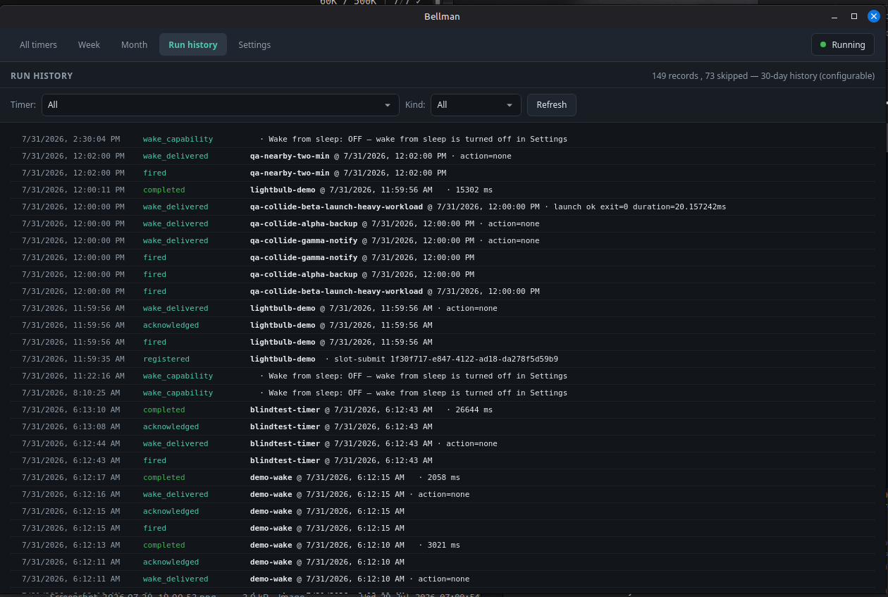

# Bellman

> ## 🚧 Work in progress — not ready to use
>
> Bellman is **under active construction.** There is no tagged release and no
> signed build: packages are built from source, unsigned, and have not been
> validated on real Windows or macOS hardware. Nothing here is stable — APIs,
> file formats, the database schema and the slot protocol can all change without
> notice, and the `main` branch is not guaranteed to build at any given moment.
>
> The repository is public so the work can be followed in the open, **not**
> because it is ready to install. Please don't file bugs about missing features
> yet. Progress is tracked in [docs/BUILD_PLAN.md](docs/BUILD_PLAN.md).

Cross-platform (Windows / macOS / Linux) **task scheduler** desktop app — the
desktop cousin of cron. Named after the bellmen (knocker-uppers) who woke
people before alarm clocks existed: Bellman's job is waking *applications*.

<p align="center">
  
</p>

<details>
<summary>More screenshots (Week · Month · Run history)</summary>

<p align="center">
  
</p>
<p align="center">
  
</p>
<p align="center">
  
</p>

All product shots live in [`docs/screenshots/`](docs/screenshots/). QA before/after captures are under [`docs/qa4-screenshots/`](docs/qa4-screenshots/).

</details>

## Install

**There is no tagged release and no signed build — you build it yourself.**
Linux is the only platform validated on real hardware today; see
[Status](#status--what-actually-exists-today).

**1. Prerequisites** (one time). Package names below are Debian / Ubuntu —
on other distributions install the equivalents.

```sh
# Rust toolchain. rustup writes ~/.cargo/env but cannot modify the shell
# you are in, so source it (or open a new terminal) before using cargo.
curl --proto '=https' --tlsv1.2 -sSf https://sh.rustup.rs | sh
source "$HOME/.cargo/env"

# Tauri v2 system dependencies
sudo apt install -y git libwebkit2gtk-4.1-dev build-essential curl wget file \
  libxdo-dev libssl-dev libayatana-appindicator3-dev librsvg2-dev

# Node 24, for the UI build. Any Node 24 works — a distro package or fnm is
# fine. Using nvm: it is a shell function rather than a binary, so it has to
# be installed and sourced before `nvm` exists as a command.
curl -o- https://raw.githubusercontent.com/nvm-sh/nvm/v0.39.7/install.sh | bash
source "$HOME/.nvm/nvm.sh"
nvm install 24

# Tauri CLI
cargo install tauri-cli --locked
```

Any Node **24.x** works — `nvm install 24` resolves to the newest 24 release,
so your version will not match anyone else's exactly. Verified on Ubuntu 24.04
with rustc 1.97.1, tauri-cli 2.11.4, and Node 24.13.0 and 24.18.1.

**This list is sufficient on its own.** It was checked by building both
bundles from scratch in a clean `ubuntu:24.04` container with nothing else
installed — no `patchelf`, `fakeroot`, `appstream` or `libfuse2`. Tauri's
AppImage bundler fetches its own tooling, and `libgtk-3-dev` arrives with
`libwebkit2gtk-4.1-dev`. (Running an `.AppImage` afterwards is a different
matter and needs FUSE on the machine that runs it.)

**2. Build the packages:**

```sh
git clone https://github.com/AccipiterTechGuy/bellman && cd bellman
cd ui && npm ci && cd ..
cargo tauri build --bundles deb,appimage --ci --no-sign
# → target/release/bundle/deb/Bellman_*.deb
# → target/release/bundle/appimage/Bellman_*.AppImage
```

`npm ci` is the only manual front-end step: `cargo tauri build` runs the UI
build and stages the `bellman` CLI sidecar itself (`beforeBuildCommand` in
`src-tauri/tauri.conf.json`), but it never installs dependencies for you.

**3. Install the deb** (or just run the AppImage):

```sh
sudo apt install ./target/release/bundle/deb/Bellman_*.deb
```

You get a **Bellman** entry in the app launcher, the `bellman` CLI on `PATH`,
and the GUI binary `bellman-app`. Verify with
`scripts/smoke_install_deb.sh` (add `SMOKE_MODE=docker` to check it in a
container instead of on the host); the manual VM checklist is in
[docs/QA_P6.md](docs/QA_P6.md).

**Windows and macOS** packages (NSIS, MSI, dmg) build unsigned in CI and have
**not** been validated on real hardware — treat them as unfinished.

Working on Bellman itself rather than installing it? See
[Development](#development).

## What it does

**These bullets describe the intended v1 design; the
[status table](#status--what-actually-exists-today) is what actually exists
today.**

- Timers with name, time, and occurrence (once / interval / daily / weekly /
  monthly / yearly), second-level resolution, year-round calendar with automatic
  new-year recalibration.
- Two drive modes: a `bellman` CLI (AI-skill friendly) and a GUI with three
  pages — events list with next-fire times, weekly repeats, monthly calendar.
- **JSON slot-pair integration layer**: external apps register, modify, or
  delete their own wake-up timers by writing one JSON file; ≥5 empty slot pairs
  are always kept ready and auto-replenished.
- **Two-way app integration**: a woken app reports back — acknowledged,
  progress, completed or failed — over JSON files or a local socket, with an
  opt-in watchdog for apps that go quiet.
- JSONL event log with weekly pruning; memory-smart core — only near-horizon
  timers stay resident (min-heap window).

## Connect your own application

Any app, in any language, can be woken by a Bellman timer and report the
outcome back — **three JSON files and one rule: one writer per file.** No SDK,
no shared library, nothing to link against; a shell script is a valid client.
Apps that prefer a socket can speak the same messages over local IPC instead.

Start here: **[docs/INTEGRATION.md → Connect your own
application](docs/INTEGRATION.md#connect-your-own-application)** — the protocol,
what each file contains, and copy-paste clients in Python, bash, PowerShell and
Node. Two reference apps in [`testing_apps/`](testing_apps/) demonstrate the full loop: copy [`testing_apps/lightbulb/`](testing_apps/lightbulb/) (~130 lines, terminal only) into your own code, or run [`testing_apps/lightbulb_gui/`](testing_apps/lightbulb_gui/) to watch the interactive window set a time, light the golden bulb, and drive the four-step handshake.

## Your data stays yours

Bellman keeps every timer, log and slot in a per-OS data directory (`~/.bellman/` on
Linux) — **never in this repository**. Cloning the code tells nobody what you schedule.
See [docs/LOCAL.md](docs/LOCAL.md) for the data-dir layout and the ignored patterns for
keeping private integrations out of git.

## Status — what actually exists today

**Everything below is built except the last line.** The scheduling core and the
app-integration surface are complete; what remains before a release is
validating the whole thing on real hardware.

**Core — timers, firing, history**

| phase | state |
|---|---|
| Occurrence engine (once/interval/daily/weekly/monthly/yearly/cron, DST + clamp policies) | ✅ built |
| SQLite store — timers / runs / claim ledger, WAL | ✅ built |
| Scheduler — horizon heap, chunked sleeps, clock-jump detector, misfire pass | ✅ built |
| Fire dispatcher — publication decoupled from action execution, bounded action lanes | ✅ built |
| JSONL event log — single durable publisher, `fdatasync` before publish, gzip weekly/size rotation, 30-day retention | ✅ built |
| Pruner, hardening, perf gates | ✅ built |

**App integration — waking other applications**

| phase | state |
|---|---|
| Slot channel — apps create / modify / delete their own timers by writing one JSON file | ✅ built |
| Per-timer folder tree — `timer.json`, `status.json`, human-browsable, rebuildable | ✅ built |
| Reply channel — per-run reply file, at-least-once delivery, pickup grace, late-reply revision | ✅ built |
| Opt-in silence watchdog — `error_detection` + `expected_secs`, heartbeats extend the deadline | ✅ built |
| Local IPC transport — Unix socket / Windows named pipe, chosen per firing, same validation as files | ✅ built |
| Reference app + protocol docs (`testing_apps/lightbulb/`, [docs/INTEGRATION.md](docs/INTEGRATION.md)) | ✅ built |

**Desktop, CLI, platform**

| phase | state |
|---|---|
| CLI (timer CRUD/run-now, slots, machine scan/task control, calendar/agenda; `--json`) | ✅ built |
| Tauri shell + tray | ✅ built |
| Calendar UI (week / month) | ✅ built |
| Live run state in the GUI — running / progress / overdue label / terminal outcomes | ✅ built |
| Wake-from-sleep (RTC) + Settings + first-run wizard | ✅ P7 (`platform::wake` + Settings + wizard) |
| Visible Scheduler (`bellman scan` / `task`) — machine-wide schedule inventory | ✅ built (Linux) |
| Calendar Snapshot (`bellman calendar` / `agenda`) — headless SVG/PNG/JSON | ✅ built |
| Packaging — deb / AppImage (Linux); NSIS, MSI, dmg unsigned in CI | ✅ built |
| **Full-system validation** — real Windows / macOS hardware, suspend-resume QA, long-run soak | ⬜ **not started — the one thing between here and a release** |

Linux `.deb` and `.AppImage` build and install today: the deb puts **Bellman** in
the app launcher and the `bellman` CLI on `PATH`. Windows (NSIS + MSI) and macOS
(dmg) packages build unsigned in CI and have **not** been validated on real
hardware. Wake-from-sleep is implemented (platform probes + Settings + wizard);
real suspend/resume hardware QA is still part of full-system validation.

## Development

Building the packages is covered under [Install](#install). This section is
for working *on* Bellman from a checkout.

### Dev launch (this tree)

```sh
./launch.sh                    # freshness-aware: fresh GUI binary, else rebuild / tauri dev
./restart_bellman.sh           # safely restart only this checkout's Bellman GUI
scripts/install_desktop.sh     # repo-controlled ~/.local/share/applications/Bellman.desktop
```

`launch.sh` never silently reuses a stale `target/release` or `target/debug`
`bellman-app`. A binary is **fresh** only when its mtime is ≥ every GUI-affecting
input (`crates/`, `src-tauri/{src,capabilities,icons,linux}`, manifests/lock,
`ui/src`, `ui/index.html`, vite/svelte configs, package files). Stale reuse
requires an explicit opt-in: `BELLMAN_ALLOW_STALE=1` (alias
`BELLMAN_APP_ALLOW_STALE=1`). Otherwise the launcher rebuilds
(`cargo tauri build --no-bundle`) or enters `cargo tauri dev` — and still will
**not** exec a still-stale binary after a no-op rebuild unless that opt-in is set.

`scripts/install_desktop.sh` installs a developer desktop entry that **Exec**s
this tree’s `launch.sh`, uses the Bellman icon from `src-tauri/icons` (not a
stock theme icon), and keeps a single main `Categories=Utility;` so
`desktop-file-validate` stays clean. Packaged deb/AppImage entries still use
`src-tauri/linux/bellman.desktop` via Tauri’s `desktopTemplate`.

Headless selection tests: `./tests/launch_freshness.sh`. Safe worktree metadata
prune: `scripts/repo_hygiene.sh` (absent worktree records only).

### Reference

See [docs/PLAN.md](docs/PLAN.md) for the full specification and decided logic,
[docs/BUILD_PLAN.md](docs/BUILD_PLAN.md) for the phased build,
[docs/research/synthesis.md](docs/research/synthesis.md) for the four-way independent
research synthesis behind the stack choice (Tauri v2 + Rust core), and
[docs/research/rtc_wake_synthesis.md](docs/research/rtc_wake_synthesis.md) for the
per-OS wake-from-sleep design.
