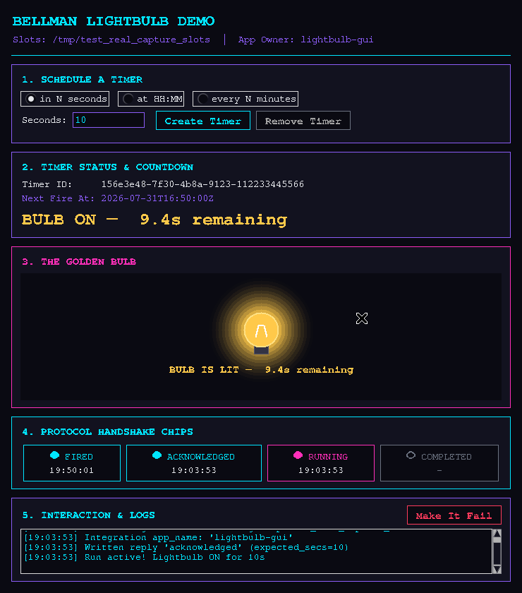

# The lightbulb GUI — Bellman's visual demo app

`lightbulb_gui.py` is the interactive visual demo of Bellman's two-way application integration protocol (`docs/INTEGRATION.md`). It provides a complete graphical interface (Tkinter) where visitors can schedule timers, watch the live countdown, see the golden filament bulb light up when fired, and track the four-step protocol handshake between Bellman and the application.



## What it shows

1. **Schedule a timer from Python**: Pick "in N seconds" (default 10), "at HH:MM", or "every N minutes". The app publishes a `bellman-slot/1` request directly over the file protocol — claiming a free stub by exclusive rename and writing the request via temp + same-directory rename.
2. **Watch the live countdown**: Displays the assigned `timer_id`, `next_fire_at`, and a live countdown timer.
3. **The 4-step protocol handshake**: Displays state chips that illuminate in sequence with real timestamps as the protocol advances:
   ```
      ● FIRED        ● ACKNOWLEDGED     ● RUNNING      ● COMPLETED
   ```
4. **The golden bulb animation**: The bulb lights up with a warm golden filament and animated concentric glow halo for the duration of the run (default 15s).
5. **"Make it fail" button**: While a run is active, click "Make it fail" to report a `failed` state with a reason, illuminating the red failure chip and updating `status.json`.
6. **Clean up after itself**: Click "Remove Timer" to send a `delete` slot request for the active timer.

## Run the demo

### Prerequisites

Standard library Python 3 only (`python3`). On minimal Linux distributions where Tkinter is packaged separately, install `python3-tk`:

```bash
sudo apt install python3-tk
```

### Usage

Start the app by pointing it to your Bellman slots directory:

```bash
python3 lightbulb_gui.py --slots ~/.bellman/slots
```

### Finding your slots root

- **CLI default**: `~/.bellman/slots` (Linux), `~/Library/Application Support/bellman/slots` (macOS), `%APPDATA%\bellman\slots` (Windows).
- **Desktop App**: `~/.local/share/io.bellman.desktop/slots` (Linux).

Options:
- `--slots DIR`: Path to the Bellman slots directory (default: `$BELLMAN_SLOTS` or `~/.bellman/slots`).
- `--app-name NAME`: Integration owner identity (default: `lightbulb-gui`).
- `--on-secs N`: Duration in seconds the bulb stays lit per firing (default: `15`).

## How it works

The GUI is standard library Python 3 with zero external dependencies. It speaks JSON over the documented file protocol, reads fire notifications dropped under `slots/fires/`, deduplicates by `run_id`, and writes atomic replies to the notification's `reply_path`. Its Tkinter event loop polls non-blockingly with `after()` callbacks so the window remains fully responsive throughout the run.
